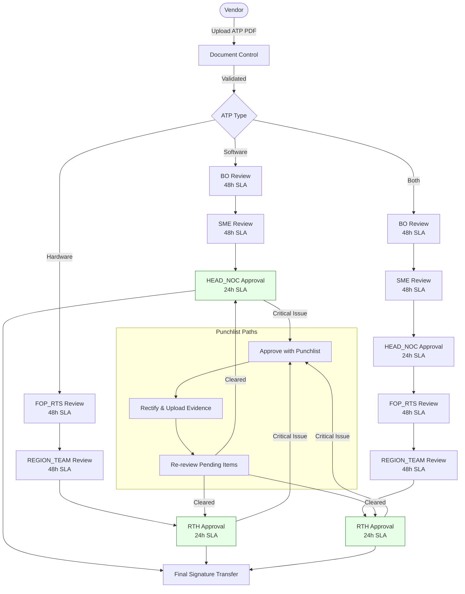

# ATP Approval Process Overview

This document summarizes the ATP (Acceptance Test Procedure) approval process implemented in the APMS project, including submission, review stages, punchlist handling, and supporting APIs/UI components.

## End-to-End Flow
1. **Document Submission** – Vendors upload hardware/software ATP PDFs for a site; Document Control validates and initializes the workflow.
2. **Review & Approval** – Role-based reviewers evaluate checklist items, decide (Approve / Approve with Punchlist / Reject), and progress through staged paths.
3. **Punchlist Rectification** – Issues flagged during review are assigned for rectification with before/after evidence and tracked to closure.
4. **Final Approval** – After all stages and punchlists are cleared, signatures are transferred and the ATP is fully approved.

## Approval Paths & SLA Targets
- **Software ATP:** BO → SME → HEAD_NOC (48h, 48h, 24h SLAs).
- **Hardware ATP:** FOP_RTS → REGION_TEAM → RTH (48h, 48h, 24h SLAs).
- **Both ATP:** Combined five-stage workflow when hardware and software are present.
- **Punchlist:**
  - *None* → move forward normally.
  - *Minor/Major* → approve with punchlist and track to completion.
  - *Critical* → vendor must rectify before proceeding.

### Visual Approval Flow

## Roles & Responsibilities
- **Vendor:** Uploads ATP documents and tracks status.
- **DOC_CONTROL:** Initial validation and submission for workflow start.
- **Reviewers:** BO, SME, HEAD_NOC (software); FOP_RTS, REGION_TEAM, RTH (hardware).
- **Field Teams:** Handle punchlist rectification with evidence uploads.

## Key UI Components
- **ATPSubmission.tsx:** Vendor submission interface with site/template selection, PDF validation, and status tracking.
- **ReviewDashboard.tsx:** Role-based queue showing pending/completed reviews, SLA indicators, and filters.
- **ApprovalInterface.tsx:** Checklist-driven review with decisions, comments, and punchlist creation.
- **PunchlistManagement.tsx:** Tracks active/completed issues with before/after evidence and rectification notes.
- **ATPProcessFlow.tsx:** Orchestrates navigation through the workflow based on permissions.

## Backend Workflow Support
- **Workflow Engine (`atpWorkflowEngine.js`):** Initializes stages, processes decisions, tracks pending/completed reviews, handles punchlist completion, and monitors SLA deadlines.
- **Primary API Routes:**
  - Workflow: initialize, submit decisions, fetch pending/completed reviews, punchlist handling, stats, workflow status.
  - Process: document submission, document control review, dashboard stats, CSV export.
  - Punchlist completion and SLA violation checks are exposed for automation and dashboards.

## Data Model Highlights
- **atp_documents:** Core ATP records with template links and form data.
- **atp_review_stages:** Stage assignments, status, decision, reviewer, and SLA deadline.
- **atp_punchlist_items:** Issues with severity, status, assignments, and evidence.
- **atp_checklist_items / atp_document_attachments:** Detailed evaluation results and uploaded files.

## Testing & Readiness
- Workflow engine and APIs validated via test scripts covering document creation, stage progression, punchlist lifecycle, SLA monitoring, and dashboard statistics.
- Production-ready status with role-based access control, audit logging, file validation, and performance optimizations (indexed queries, pagination, caching preparation).
